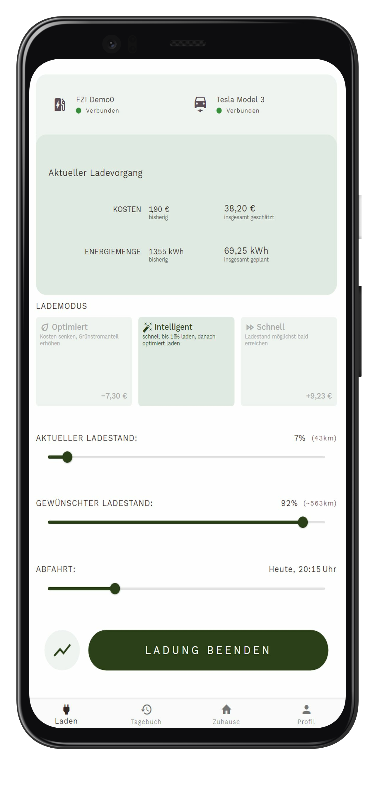
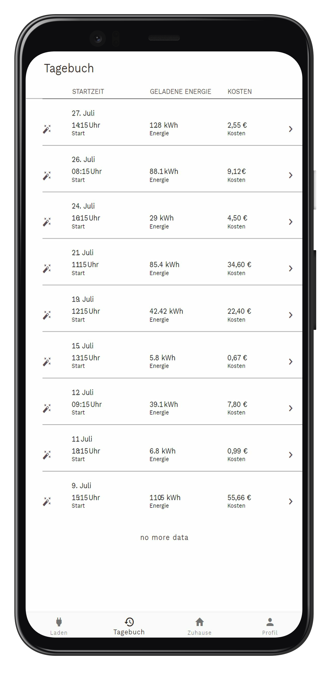

# Smart-Charging App

This repo represents a generic Smart-Charging App for managing smart-charging transactions in a private environment.
This app is a flutter app (multi-platform) for giving access to a generic smart-charging system.
To use the app you need to set up SmartCharging-Backend as this app uses the REST-Api from backend.

Example app can look like the following:

App with running charging session            |  Charging Session history
:-------------------------:|:-------------------------:
|     |  | |

## Features
-  Authentication of user with KeyCloak (OpenId-Connect API)
- Starting and Stopping charging transactions
- Display state of current charging transactions (SOC, Charging Price,...)
- Charging Transaction History
- (Household overview; Chart that shows which component need how much power)
- Profile Settings (set/edit user vehilces, currently used charge point)

## Contributions
This flutter app was developed by:

- **Mario Fellger** 
     - First App Version
     - Documented in Thesis "Anforderungsanalyse und
Implementierung einer mobilen App zur Erschließung der Flexibilität von Ladevorgängen"

- **Pascal Petzoldt** 
    - App exension, use of new App-Backend
    - Documented in Thesis "Erweiterung einer Mobilanwendung zur
Nutzerinteraktion und Integration in
ein bestehendes intelligentes
Ladesystem"

## Configuration
Confguration file is located in `lib/local/configuration.dart`.
There you can specify following configurations:

        static String BackendApiUrl = "http://localhost:8080/"; //URL to App Backend
        static String KeyCloakBaseUrl ="http://193.196.39.75:8080/"; // Base URL for KeyCloak
        static bool UseKeyCloakAuth = false; //Bypass Authentication flag

 - BackendApiUrl
     -  Specify Url where App-Backend is accessible
 - KeyCloakBaseUrl
     - Specify Url where KeyCloak Instance is running
 - UseKeyCloadAuth
     - Flag is App should use KeyCloak Authenticiation, it is turned of for demonstration mode, because there is no demo KeyCloak instance

## KeyCloak support
Due to license, the origin file of `keycloak.js` can't be included in `web/js/`.
To include it anyway, you can execute script `add_keykloak.js` which modifies base html and downloads JavaScript file.
To use with docker, set ARG `INCLUDE_KEYCLOAK` to `true` in `docker/docker-compose.yml`

## Install and Run

You can clone this repo an build on your own (current supported Flutter Version is *3.10.5*) or use predefined build process for web with docker:

Just start the docker compose file with:

    $~charging-app/docker: docker compose up -d

If you don't want to start detached, remove *-d* from cli. 
This docker compose will create a container build the complete app via flutter and start a simple nginx server which includes the flutter output files. 
At the end you can browse to port 8000 to access app frontend.
Keep in mind that the app throws errors if no app-backend is available. 

If you want to host this app on your own, you can only start flutter build process. 
Go to charging-app/docker and execute:

     $~/charging-app/docker: ./build-flutter.sh

this will build the app in web environment.

The build scrips starts a docker container which will to the build for flutter in web mode.
Output will be at *~/charging-app/build/web.*
